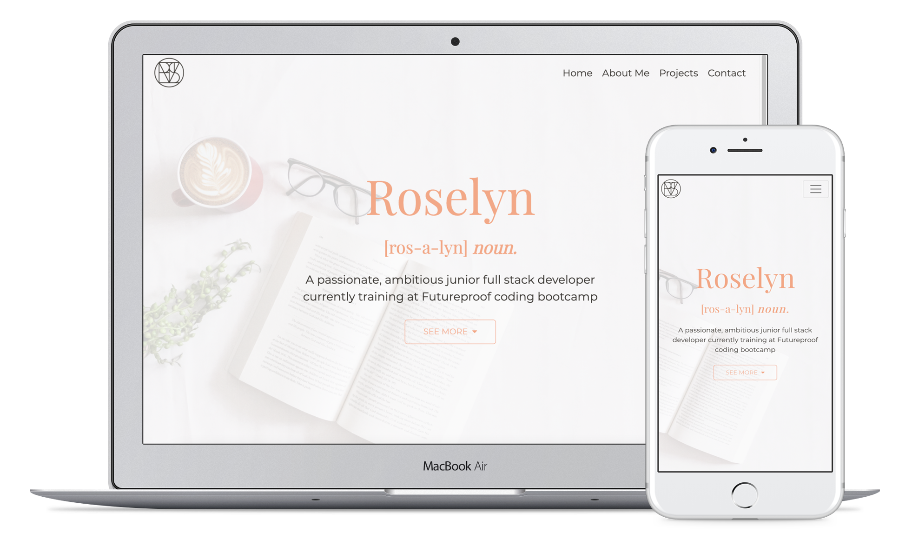

# Roselyn Le - Portfolio

This webpage serves as an online portfolio and displays my web presence, background, skills, projects and contact information. 

### How to access

Access deployed site here: http://roselyn-le.netlify.app/

## Technologies used

-   HTML5, CSS3, JavaScript
-   Additional libraries/frameworks:
    - Bootstrap for styling and implementing functionalities with jQuery
    - Font Awesome for the icons
    - Animate on Scroll library for the fading animations

## Wins & Challenges

### Wins
-   Implemented a smooth scroll to section when links are clicked. On mobile view, the burger bar is also collapsed when a link is clicked
-   Added fading animation effects using the Animate on Scroll library
-   Used CSS keyframes to create a text spin effect on the image caption (on desktop)
-   Created a transparent navbar which becomes a solid colour on scroll
-   Successfully utilised Bootstrap for: styling of page, turning project cards into a carousel, creating collapsible divs using buttons

### Challenges

-   Difficulties with Bootstrap overriding CSS styles and positioning things in the intended places
-   Issues with getting the card carousel to work
-   Making the page responsive on mobile and tablet devices, features such as carousel and animations caused some responsivenes bugs

## Bugs

-   Image caption has a text spin animation on desktop view, however the text does not animate on mobile view
-   Page is slow to fully render on the initial visit, most sections load fairly quickly but the projects section takes a bit more time (although this shouldn't be an issue as it will have loaded by the time the user gets to that section - unless the user decides they want to see the projects first)
-   Due to the animations there could be some responsiveness issues on initial load on mobile devices. However, this should automatically fix itself when the page has fully rendered
-   When you click on a link in the navbar, it will change colour to indicate that it is the active link. However the colour still remains if you go to another section by scrolling the page.